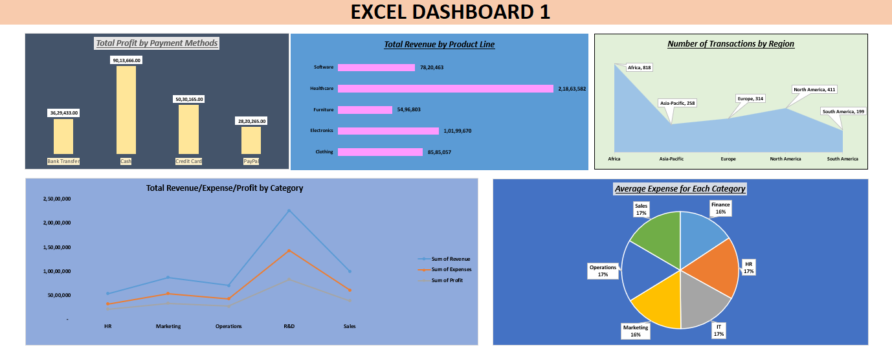

# 📊 Sales Performance & Financial Analytics Dashboard

## 📝 Project Overview
This project is a data-driven Excel dashboard that analyzes over **2,000 sales transactions** to track company growth and profitability. It provides a multi-dimensional view of business health across various regions, departments, and product lines.

The goal was to turn complex financial data into a visual story that helps in making quick, data-backed decisions.

## 📸 Dashboard Preview

## ✨ Key Business Insights (Based on Analysis)
* **Total Revenue:** Generated over **$53.9M** in total sales.
* **Profitability:** Achieved a net profit of **$20.4M**.
* **Top Product Line:** **Healthcare** emerged as the strongest sector, contributing **$21.8M** in revenue.
* **Regional Dominance:** **Africa** is the highest-performing region with **818 transactions**.
* **Preferred Payments:** **Cash transactions** drove the highest profit ($9M) compared to other methods.
* **Leading Department:** The **R&D department** outperformed others with a revenue of **$22.7M**.

## 🛠️ Technical Features
* **Data Cleaning:** Processed a large dataset with 2,000+ entries.
* **Dynamic Charting:** * **Line Charts** for Revenue vs. Profit trends.
    * **Pie Charts** for Departmental Expense distribution.
    * **Bar/Column Charts** for Product and Payment Method analysis.
    * **Area Charts** for Regional Density.
* **Pivot Tables:** Used for fast data aggregation and multi-layered filtering.

## 📂 File Structure
* `practices 3.xlsx`: The core file containing the data, calculations, and the visual dashboard.
* `dashboard.png`: Screenshot of the final dashboard.

## 🚀 How to Use
1. Download the repository as a ZIP or clone it.
2. Open the `.xlsx` file in Microsoft Excel.
3. Switch between the tabs (Dashboard, Line chart, Bar chart, etc.) to explore specific data views.

---
**Author:** [Hrishabh]
 [rishabbhadoriya62@gmail.com]
 [LinkedIn Profile]([)](https://www.linkedin.com/in/hrishabh-bhadoriya-6487bb2ba?utm_source=share&utm_campaign=share_via&utm_content=profile&utm_medium=android_app)
